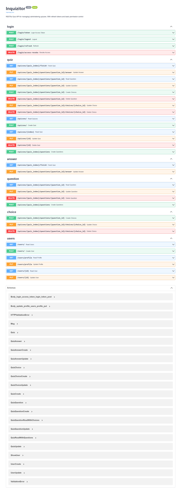

## SETUP

0. Install poetry: `pip install poetry`, then clone the repository
1. Change directory to `inquizitor` 
2. Make a copy of the file `.env.example`, rename it to `.env`, and set environment variables. Or don't change content of file to use default values for development. See `.env.example` file for reference
3. Activate virtual environment using the command `poetry shell`
   - Make sure the virtual environment is activated before running commands within the project folder
4. Install project dependencies: `poetry install`
5. Initialize database: `python main.py initial-data`
6. Run the app: `uvicorn main:app --reload`

 

## DEV

| Username | Password     |
| -------- | ------------ |
| admin    | superadmin   |
| teacher  | superteacher |
| student  | superstudent |

- Reset database: `python main.py initial-data`
- Run tests: `pytest`
- Use [Black Playground](https://black.vercel.app/) to check if code snippet conforms to PEP8
- View SQLite database using [sqlitebrowser](https://sqlitebrowser.org/dl/) , otherwise use pgadmin
  - if using SQLite, run the installed sqlitebrowser
  - on the main white space upon running the app, drag&drop the `data.db` file (found within app module after running initial-data)  
  - under the Tables(n) tab, right-click the table you want to view and select 'Browse'

  

## DOCUMENTATION

to access the interactive API documentation, go to http://127.0.0.1:8000/docs

